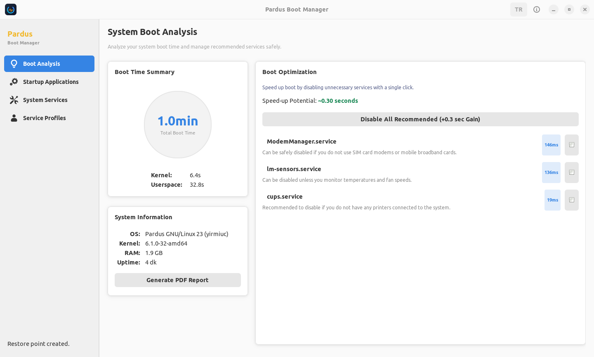
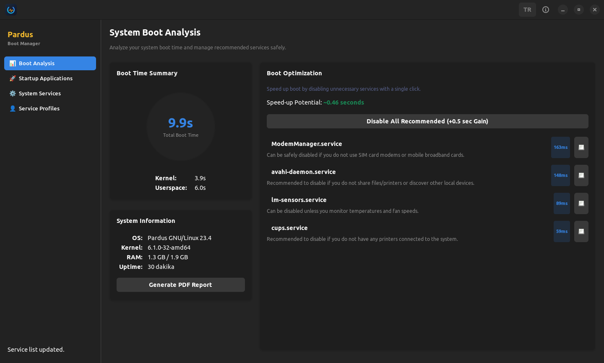
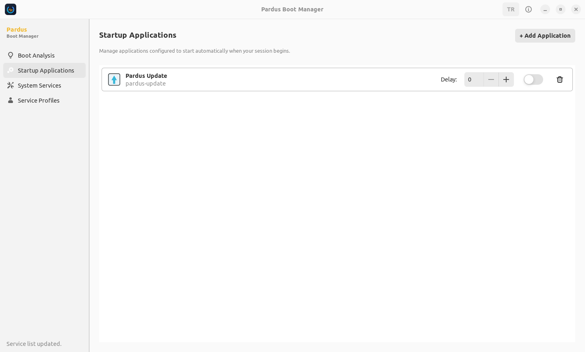
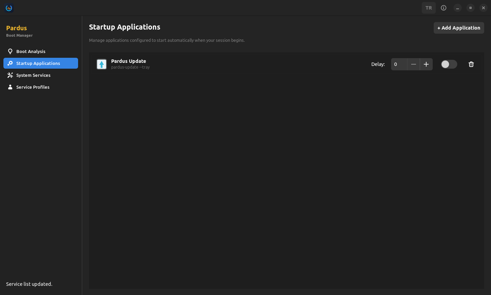
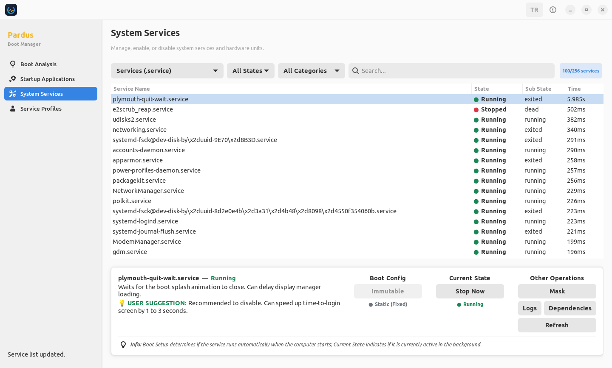
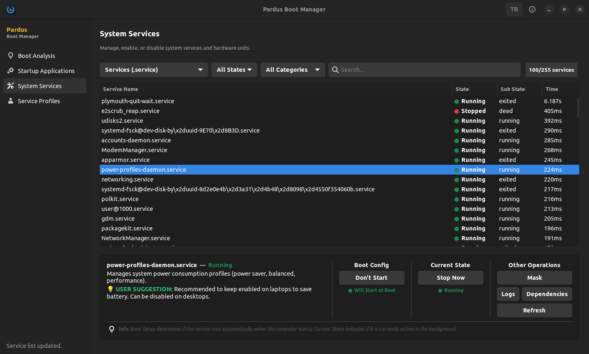
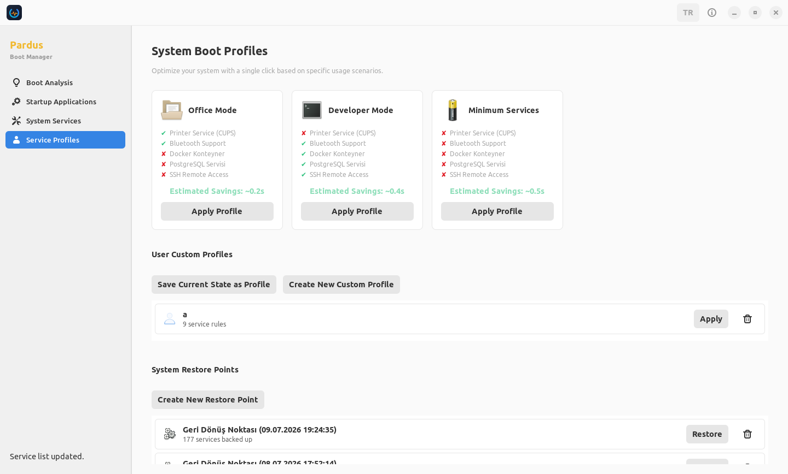
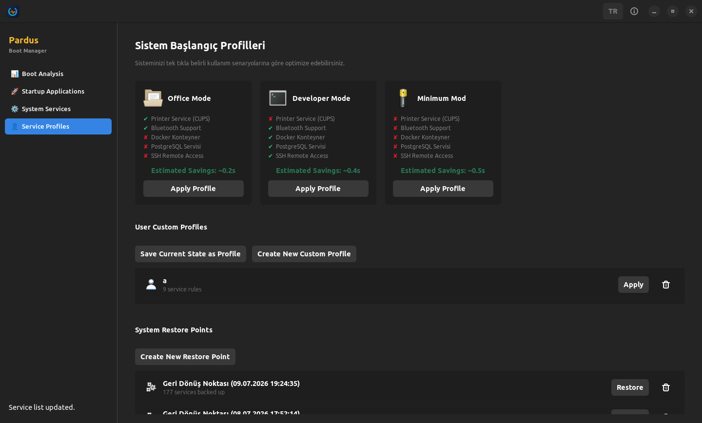

<p align="center">
  
</p>

# Pardus Başlangıç Yöneticisi

[English Version (İngilizce Sürüm)](README_EN.md)

Pardus Başlangıç Yöneticisi, sisteminizin açılış süresini analiz etmek, başlangıçta çalışan gereksiz servisleri ve uygulamaları optimize etmek amacıyla geliştirilmiş bir masaüstü uygulamasıdır.

### Proje Hakkında
Bu uygulama, bağımsız bir geliştirici tarafından 2026 TEKNOFEST Pardus Hata Yakalama ve Öneri Yarışması kapsamında Geliştirme Kategorisi için hazırlanmıştır.

### Geliştirici
* [**İbrahim Hakkı Ergin**](https://github.com/06ergin06)

### Ekran Görüntüleri

| Sayfa | Açık Tema | Koyu Tema |
| :---: | :---: | :---: |
| **Analiz (Dashboard)** |  |  |
| **Başlangıç (Autostart)** |  |  |
| **Hizmetler (Services)** |  |  |
| **Profiller (Profiles)** |  |  |

---

## Özellikler

* **Açılış Süresi Analizi:** Sisteminizin açılışındaki donanım, önyükleyici (loader), çekirdek (kernel) ve kullanıcı alanı (userspace) yüklenme sürelerini grafiksel olarak görüntüler.
* **Hizmet Optimizasyonu (systemd):** Sistem servislerinin açılış sürelerini sıralar ve tek tıkla kapatılabilecek güvenli servisleri tespit ederek hızlandırma potansiyeli sunar.
* **Açılış ve Anlık Durum Ayrımı:** Servislerin başlangıç ayarlarını (açılışta çalışsın/çalışmasın) ve o anki çalışma durumlarını (şimdi başlat/durdur) ayrı ayrı yönetebilmenizi sağlar. Çift yönlü işlem önerileri sunar.
* **Özel Profil Yönetimi:** Ağ, Sunucu, Ofis gibi hazır optimizasyon profillerini uygulayabilir veya kendi özel servisinizi ekleyip yedekleyebilirsiniz.
* **Başlangıç Uygulamaları:** Kullanıcı oturumu başladığında otomatik çalışan uygulamaları listeleyebilir, yenilerini ekleyebilir veya kaldırabilirsiniz.
* **PDF Raporlama:** Sistem açılış sürelerini, donanım bilgilerini, en yavaş çalışan 5 servisi ve önerilen optimizasyonları içeren profesyonel bir PDF raporu oluşturur.
* **Yerel Log İzleyici:** Yetki gerektiğinde otomatik olarak yönetici doğrulaması talep ederek servislerin systemd günlük kayıtlarını (journalctl) gösterir.

## Gereksinimler

Uygulamanın çalışması için aşağıdaki paketlerin sisteminizde kurulu olması gerekmektedir:

* python3
* python3-gi (PyGObject)
* gir1.2-gtk-3.0
* python3-cairo

Pardus/Debian üzerinde yüklemek için:
```bash
sudo apt install python3 python3-gi gir1.2-gtk-3.0 python3-cairo
```

## Kurulum ve Çalıştırma

### Kaynak Koddan Çalıştırma

Depoyu klonladıktan sonra proje dizininde şu komutla uygulamayı çalıştırabilirsiniz:
```bash
python3 main.py
```

### Debian Paketi (.deb) Kurulumu

* **Arayüz ile Kurulum (Pardus):** `.deb` paketine çift tıklayarak **Pardus Paket Kurucu** ile kolayca yükleyebilirsiniz.
* **Terminal ile Kurulum:**
  ```bash
  sudo dpkg -i pardus-boot-analyzer_1.0.0_all.deb
  sudo apt install -f
  ```

### AppImage Taşınabilir Paket Kurulumu

Uygulamayı herhangi bir kuruluma gerek kalmadan taşınabilir AppImage olarak çalıştırmak için:
```bash
chmod +x Pardus_Boot_Analyzer-x86_64.AppImage
./Pardus_Boot_Analyzer-x86_64.AppImage
```

### Arch Linux (AUR) Kurulumu

Uygulamayı Arch Linux veya tabanlı dağıtımlarda (Manjaro, EndeavourOS vb.) doğrudan AUR üzerinden kurabilirsiniz:
```bash
yay -S pardus-boot-analyzer-git
```
veya
```bash
paru -S pardus-boot-analyzer-git
```

### Debian ve AppImage Paketi Oluşturma

Projeyi yeniden derlemek ve paketlemek için dizindeki paketleme betiklerini çalıştırabilirsiniz:
```bash
./build_deb.sh
./build_appimage.sh
```

## Lisans
Bu proje [GPL-3.0 Lisansı](LICENSE) altında lisanslanmıştır.
